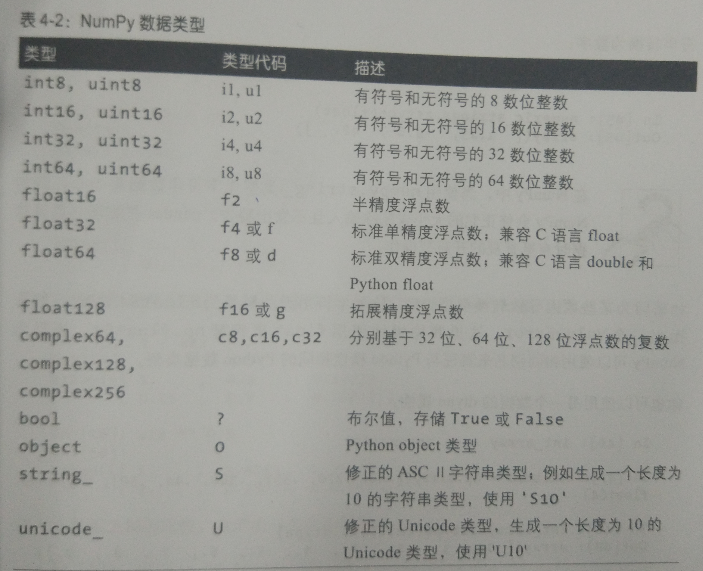
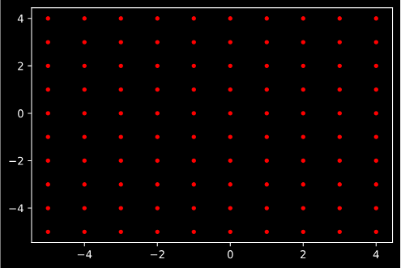

# 数据处理
## Section1 语言基础
### python的优势与局限
- 开源社区的努力
- python作为语言间的胶水特性
- 但解释型语言效率慢，GIL对多线程的约束
### 重要的py库
1. NumPy 
    - 快速、高效的多维数组对象ndarray
    - 基于元素的数组计算或数组之间的数学操作
    - 用于读写硬盘中基于数组的数据集工具
    - 线性代数操作、傅里叶变换以及随机数生成
    - 成熟的C语言API，允许Python拓展和本地C++或C访问NumPy数据结构和计算设施
2. Pandas
    - 带有标签轴，支持自动化或显示数据对齐功能的数据结构
    - 集成时间序列函数功能
    - 能够同时处理时间序列数据和非时间序列数据的统一数据结构
    - 可以保存元数据的算数操作和简化
    - 灵活处理缺失数据
    - 流行数据库中的合并等关系型操作
3. matplotlib
    - 制图和二维数据可视化
4. IPython 与 Jupyter
    - IPython 一款更具交互性的Python解释器
    - Jupyter 则是适用于多语言的交互式
5. SciPy
    - scipy.intergrate 数值积分例程和微分方程求解器
    - scipy.linalg 线性代数例程和基于numpy.linalg的矩阵分解
    - scipy.optimize 函数优化器和求根算法
    - scipy.signal 信号处理工具
    - scipy.sparse 稀疏矩阵与稀疏矩阵线性求解器
    - scipy.special SPECFUN的包装器，这是一个Fortran语言下实现的通用数据函数包
    - scipy.stats 标准的连续和离散概率分布、各类统计测试、各类描述性统计
6. scikit-learn 机器学习工具包
    - 分类：SVM、最近邻、随机森林、逻辑回归
    - 回归：Lasso、岭回归
    - 聚类：k-means、谱聚类
    - 降维：PCA、特征选择、矩阵分解
    - 模型选择：网格搜索、交叉验证、指标矩阵
    - 预处理：特征提取、正态化
7. statsmodels
    - 回归模型：线性回归、通用线性模型、鲁棒线性模型、线性混合效应模型
    - 方差分析： ANOVA
    - 时间序列分析：AR、ARMA、ARIMA、VAR
    - 非参数方法：核密度估计、核回归
    - 统计模型结果可视化
### 分析数据的步骤

与外部世界交互——准备——转换——建模和计算——演示

### 导包
```
import numpy as py
import matplotlib.pyplot as plt
import pandas as pd
import seaborn as sns
import statsmodels as sm
```
### IPython 和 Jupyter notebook
- Tab   自动补全
- print?    对象内省
- add_numbers??     源代码
- %run 运行python程式文件 -i  使用命名空间已有的变量
- %load 导入代码单元
- 中断
- %paste 获取剪切板的程式并运行
- %cpaste 给予复制的空间
- 终端快捷键

- 更多的魔术方法：%timeit检查执行时间
- %quickref  %magic 探求所有特殊命令
- %matplotlib 集成，绘画窗口不干扰命令窗口

## Section2 NumPy
1. NumPy 
    - 快速、高效的多维数组对象ndarray
    - 基于元素的数组计算或数组之间的数学操作
    - 用于读写硬盘中基于数组的数据集工具
    - 线性代数操作、傅里叶变换以及随机数生成
    - 成熟的C语言API，允许Python拓展和本地C++或C访问NumPy数据结构和计算设施
### 测试性能
```
import numpy as np
my_array = np.arange(1000000)
my_list = list(range(1000000))

'''
%time for _ in range(10) : my_arr2 = my_array * 2
Wall time: 26 ms
%time for _ in range(10) : my_list2 = [ x*2 for x in my_list]
Wall time: 1.09 s
'''
```
### ndarray 多维数组对象
创建随机的ndarray对象   ```np.random.randn(2,3,4)```

ndarray对象的纬度和属性 ```data.shape ndim``` ```data.dtype```

#### ndarray生成函数
- array     将输入数据（list，tuple，array）转化为ndarray
- asarray   将输入转化为ndarray，如果已是则不再赋值
- arange    返回一个数组range版
- ones      全1数组
- ones_like 根据给定数组生成形状一样的全1数组
- zeros     全0数组
- zeros_like根据给定数组生成形状一样的全0数组
- empty     没有初始化数组
- empty_like根据给定数组生成形状一样的没有初始化数组数组
- full      指定数值初始化数组
- full_like 根据给定数组生成形状一样的指定数值初始化数组
- eye,identity特征矩阵
#### 数据类型
np.float64


可以使用astype强转数据类型
#### numpy 向量化运算
#### 基础索引和切片
ndarray切片只是原数组视图，所以修改会反馈到原数组，正常来说要复制要copy

索引的话没啥好说的和C的区别在于[,]||[][]没有本质不同
#### 布尔索引
布尔值是可以进行索引的，如下
```
names = np.array(['Bob','a','b','c','Bob','d','e'])
array(['Bob', 'a', 'b', 'c', 'Bob', 'd', 'e'], dtype='<U3')
data = np.random.randn(7,4)
array([[ 0.64622004,  1.48600473,  1.06459521, -0.44768794],
       [ 2.07330765,  1.61229412,  1.30045085,  1.96736726],
       [-0.4523206 ,  0.054319  , -1.71376844, -0.56255751],
       [ 1.22613763, -0.07508477,  1.59365656,  0.94949302],
       [-0.35118141,  0.29118397, -0.87797734,  0.27421335],
       [ 0.8016572 , -1.04509649,  0.42147182,  1.25773938],
       [-0.7974668 ,  0.64391535,  0.28606232,  0.64815772]])

data[names == 'Bob']
array([[ 0.64622004,  1.48600473,  1.06459521, -0.44768794],
       [-0.35118141,  0.29118397, -0.87797734,  0.27421335]])
```
bool值联合需要用 | &

而布尔索引返回的值是拷贝不会影响原数组

但是直接对索引赋值还是改变的原数组
#### 神奇索引
可以直接传入list索引数组
```
arr = np.empty((8,4))
for i in range(8):
    arr[i] = i
arr[[1,2,3]]
>array([[1., 1., 1., 1.],
       [2., 2., 2., 2.],
       [3., 3., 3., 3.]])
```
reshape:shape代表维度，强转维度使用
```
arr.reshape((4,8))
>array([[0., 0., 0., 0., 1., 1., 1., 1.],
       [2., 2., 2., 2., 3., 3., 3., 3.],
       [4., 4., 4., 4., 5., 5., 5., 5.],
       [6., 6., 6., 6., 7., 7., 7., 7.]])
```
同样神奇索引也会复制一个新数组
#### 数组转置和换轴
置换轴：
```
arr = arr.reshape((2,4,8))
```
- arr.T 纯粹的翻转轴，如[x,y,z]变成[z,y,x]
- arr.transpose((1,0,2)) 编排轴的顺序
- arr.swapaxes(1,2)
矩阵内积：行向量乘以列向量
- np.dot(arr.T,arr)
#### 通用函数，逐元素操作函数
1. 一元通用函数
    - abs,fabs  绝对值
    - sqrt      平方根
    - square    平方
    - exp       自然指数
    - log,log10,log2,log1p  自然对数
    - sign      符号值
    - ceil      最高整数值
    - floor     最小整数值
    - rint      保留整数位
    - modf      分别返回整数和小数部分
    - isnan     布尔判断NaN
    - isfinite,isinf    是否有限（非INF，NaN），是否无限，布尔
    - cos,cosh,sin,sinh,tan,tanh    常规双曲三角函数
    - arccos,arccosh.arcsin,arcsinh,arctan,arctanh  反三角函数
    - logical_not   按位取反
2. 二元通用函数
    - add   相加
    - subtract  在第二个中剔除存在于第一个的
    - multiply  相乘
    - divide,floor_divide   除或整除
    - power     第一个元素的第二个元素的幂次方
    - maximum,fmax  最大值，（忽略NaN）
    - minimum,fmin  最小值，（忽略NaN）
    - mod       求模
    - copysign  依第一组修改第二组的符号值
    - greater,greater_equal,less,less_equal,equal,not_equal >,>=,<,<=,=,!=返回布尔
    -logical_and,logical_or,logical_xor 逻辑操作（&，|，^）
#### 面向数组编程
np.meshgrid 依据两个一维数组生成(x,y)对的二维矩阵
```
points = np.arange(-5,5,0.1)
xs,ys = np.meshgrid(points,points)
plt.plot(xs, ys,
         color='red',  # 全部点设置为红色
         marker='.',  # 点的形状为圆点
         linestyle='')  # 线型为空，也即点与点之间不用线连接
```

#### 条件逻辑，数组操作
np.where    这是 x if condition else y 的向量化版本

np.where(condition,x,y)
#### 数学和统计方法
- sum       轴向累计和
- mean      轴向平均值
- std,var   标准差和方差
- min,max   最大值和最小值
- argmin,argmax 最大值和最小值的位置
- cumsum    0开始累计和
- cumprod   1开始累计积
#### 布尔值数组
bool.any()  至少一个True

bool.all()  是否全是True

布尔值True强制当做1，False当做0
#### 排序
np.sort 同样可以传入维度进行排序
#### 其他逻辑集合
- unique(x)         唯一值并排序
- intersect1d(x,y)  交集，排序
- union1d(x,y)      并集，排序
- in1d(x,y)         x是否包含在y中，返回布尔
- setdiff1d(x,y)    差集，存在x不存在于y
- setxor1d(x,y)     异或集，在x或y，但不同时存在
#### 使用数组进行文件输入和输出
- np.save   压缩存
- np.load   取
- np.savez  存字典
- np.savez_compressed 压缩存字典
#### 线性代数
- *         矩阵逐元素乘积
- np.dot,@  点乘
- np.linalg 拥有一个矩阵分解函数集
    - diag  将对角作为一维数组返回，将一维转化为非对角零点的方阵
    - dot   矩阵点乘
    - trace 计算对角元素和
    - det   计算矩阵行列式
    - eig   特征值，特征向量
    