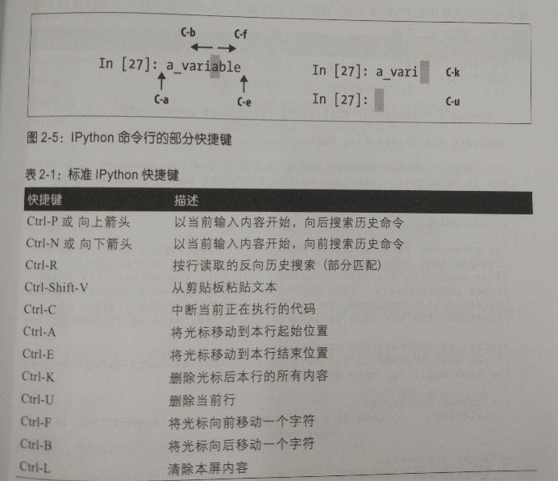

# 数据处理
## Section1 语言基础
### python的优势与局限
- 开源社区的努力
- python作为语言间的胶水特性
- 但解释型语言效率慢，GIL对多线程的约束
### 重要的py库
1. NumPy 
    - 快速、高效的多维数组对象ndarray
    - 基于元素的数组计算或数组之间的数学操作
    - 用于读写硬盘中基于数组的数据集工具
    - 线性代数操作、傅里叶变换以及随机数生成
    - 成熟的C语言API，允许Python拓展和本地C++或C访问NumPy数据结构和计算设施
2. Pandas
    - 带有标签轴，支持自动化或显示数据对齐功能的数据结构
    - 集成时间序列函数功能
    - 能够同时处理时间序列数据和非时间序列数据的统一数据结构
    - 可以保存元数据的算数操作和简化
    - 灵活处理缺失数据
    - 流行数据库中的合并等关系型操作
3. matplotlib
    - 制图和二维数据可视化
4. IPython 与 Jupyter
    - IPython 一款更具交互性的Python解释器
    - Jupyter 则是适用于多语言的交互式
5. SciPy
    - scipy.intergrate 数值积分例程和微分方程求解器
    - scipy.linalg 线性代数例程和基于numpy.linalg的矩阵分解
    - scipy.optimize 函数优化器和求根算法
    - scipy.signal 信号处理工具
    - scipy.sparse 稀疏矩阵与稀疏矩阵线性求解器
    - scipy.special SPECFUN的包装器，这是一个Fortran语言下实现的通用数据函数包
    - scipy.stats 标准的连续和离散概率分布、各类统计测试、各类描述性统计
6. scikit-learn 机器学习工具包
    - 分类：SVM、最近邻、随机森林、逻辑回归
    - 回归：Lasso、岭回归
    - 聚类：k-means、谱聚类
    - 降维：PCA、特征选择、矩阵分解
    - 模型选择：网格搜索、交叉验证、指标矩阵
    - 预处理：特征提取、正态化
7. statsmodels
    - 回归模型：线性回归、通用线性模型、鲁棒线性模型、线性混合效应模型
    - 方差分析： ANOVA
    - 时间序列分析：AR、ARMA、ARIMA、VAR
    - 非参数方法：核密度估计、核回归
    - 统计模型结果可视化
### 分析数据的步骤

与外部世界交互——准备——转换——建模和计算——演示

### 导包
```
import numpy as py
import matplotlib.pyplot as plt
import pandas as pd
import seaborn as sns
import statsmodels as sm
```
### IPython 和 Jupyter notebook
- Tab   自动补全
- print?    对象内省
- add_numbers??     源代码
- %run 运行python程式文件 -i  使用命名空间已有的变量
- %load 导入代码单元
- 中断
- %paste 获取剪切板的程式并运行
- %cpaste 给予复制的空间
- 终端快捷键

- 更多的魔术方法：%timeit检查执行时间
- %quickref  %magic 探求所有特殊命令
- %matplotlib 集成，绘画窗口不干扰命令窗口

## Section2 NumPy

